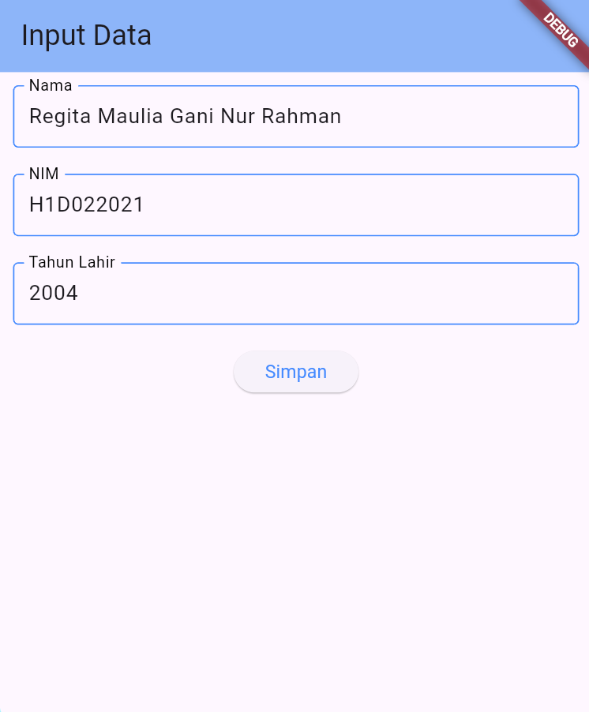

# Tugas Pertemuan 2

Nama : Regita Maulia Gani Nur Rahman
NIM : H1D022021
Shift Baru: C

# Penjelasan
Proses passing data dari form menuju tampilan:
1. User input data
   Pada form_data.dart, terdapat form input dengan 3 field, yaitu nama, NIM, dan tahun lahir. Setiap field input menggunakan TextField dan kontrolnya diatur oleh TextEditingController, seperti \_namaController untuk menyimpan teks input dari field nama. Saat tombol 'Simpan' ditekan (\_tombolSimpan()), data dari form diambil lalu disimpan ke dalam variabel, seperti nama mengambil teks dari \_namaController, tahun diubah dari string ke integer menggunakan int.parse() dari \_tahunController.
2. Mengirim data ke halaman TampilData
   Menggunakan Navigator.of(context).push() untuk melakukan navigasi antar halaman dengan MaterialPageRoute yang berfungsi membuat rute baru menuju halaman TampilData.
3. Data diterima di halaman TampilData dalam bentuk parameter yang diinisialisasi di konstruktor (final String nama, final String nim, final int tahun). final int umur = DateTime.now().year - tahun; untuk menghitung umur dengan mengurangi tahun sekarang (DateTime.now().year) dari tahun lahir (tahun). Lalu ditampilkan ke layar.

## Screenshot

